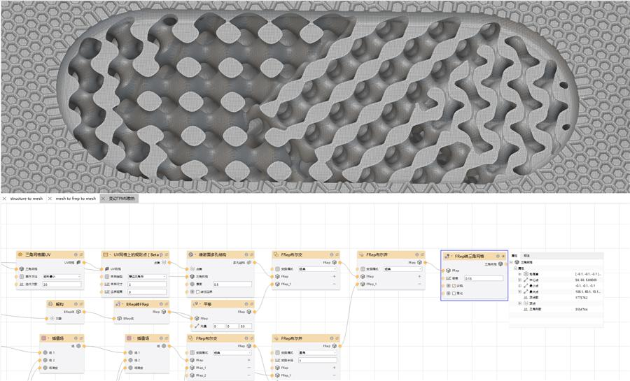

Implicit modeling is where I explore field-based geometry construction, representation conversion, and practical workflows that connect design intent with manufacturable mesh data.

  <a class="implicit-gallery-item" href="/project/implicit-to-mesh/">
    
    
      <strong>Implicit-to-Mesh Conversion</strong>
      <em>Node-based conversion from implicit geometry into triangle mesh data.</em>
    
  </a>

More implicit modeling cases, screenshots, and model studies will be collected here.
