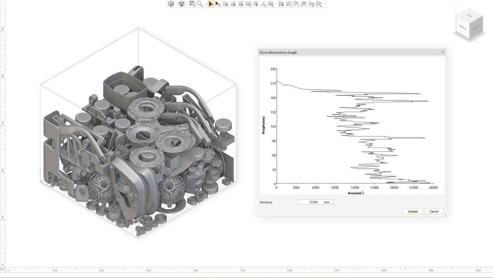
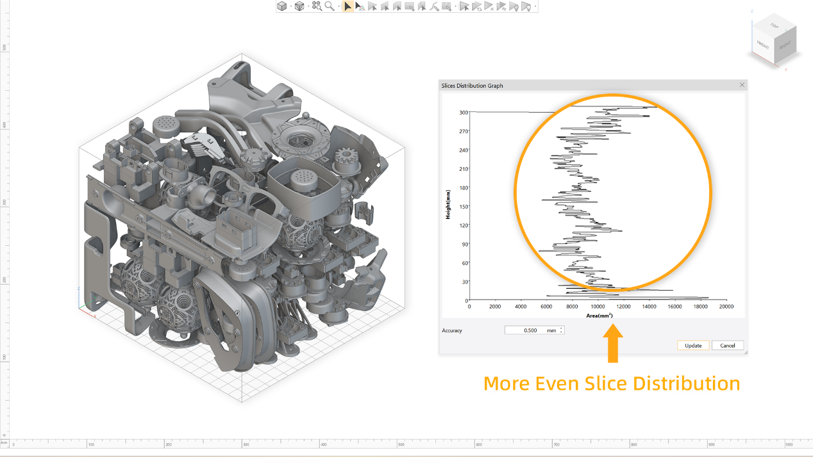
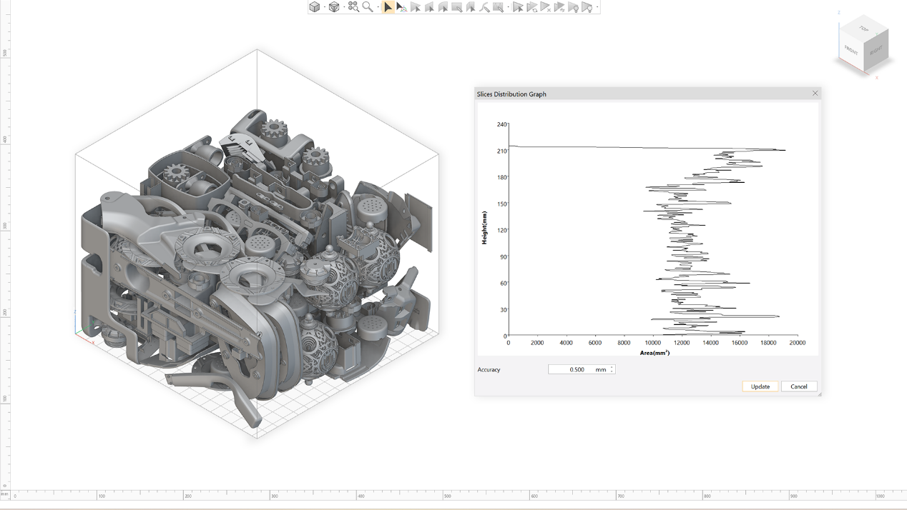
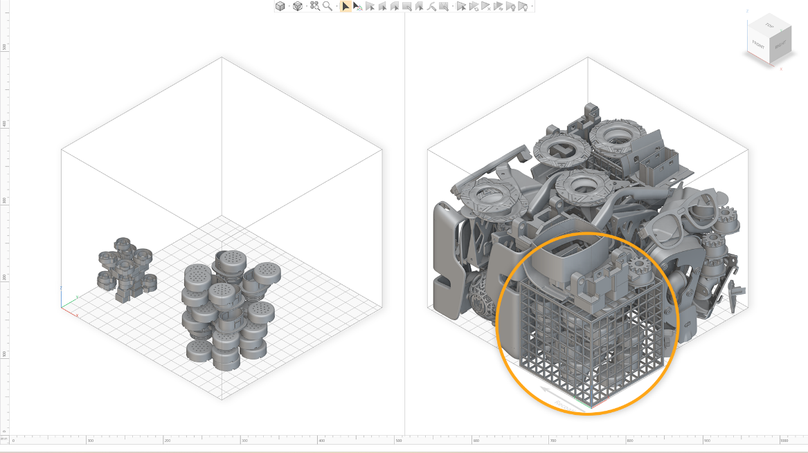

Nesting is a crucial technique in Powder Bed Fusion technologies like Selective Laser Sintering (SLS) 3D printing, which enables the production of large builds containing hundreds of items.

Efficient nesting maximizes cost-effectiveness by densely packing parts within a single build, reducing material waste and production time. By optimizing the placement of parts on the printing bed, nesting allows for the highest number of parts per printing volume in a single run—enhancing both efficiency and material savings.

## 1.Accelerate the Nesting Process
Providing quick and accurate nesting results is essential for users, who manage large quantities of parts daily. we use GPU acceleration to expedite the nesting process. With a single click, parts are automatically nested in an optimal way and can be distributed across multiple platforms.

## 2.Different Nesting Methods for Different User Scenarios 
### a.Reduce the Height of the Build
Limit the maximum build height to save the build time. When calculating the cost of an SLS 3D printing order, the XYZ dimensions of the part are used to determine the bounding box volume. By reducing the Z-height of the batch, the build time will be saved. This is because 3D printers typically print faster in the X and Y directions than in the Z (height) direction. 

### b.Nesting with Slice Distribution
The slice distribution is also very important in SLS printing. An evenly distributed slice area means evenly distributed heat, which leads to better print quality.

For an optimal build, the surface area to be scanned per layer should be relatively consistent. When checking the slice distribution graph of platform, a more consistent broken line indicates a healthier build. Optimizing the slice distribution ensures better printing quality.

### c.Nesting with Both Height and Slice Distribution
Considering both height and slice distribution helps ensure lower cost and high-quality parts. It is important not only to pack as many parts as possible but also to minimize the risk of printing errors and crashes. To avoid risk, it is critical to leave sufficient space between parts. If parts are placed too close together, heat buildup can occur, leading to issues such as sticking, shrinking, warping or over-sintering. Running a slice distribution map allows you to identify area where excessive heat may be generated during printing, enabling proactive adjustments for a more reliable and successful build.

## 3.Classify parts during nesting
The sub-nesting feature serves multiple purposes: it prevents small parts from getting lost, protects fragile parts from scraping, and groups parts from different companies. After sub-nesting, users can create Sinterboxes to segregate the parts. For parts from a single company, each Sinterbox can be labeled to explain to operator of it contains. Additionally, Sinterboxes offer protection for parts that are too small or fragile to remove from the powder bed, ensuring their safety during post-processing and shipping.

