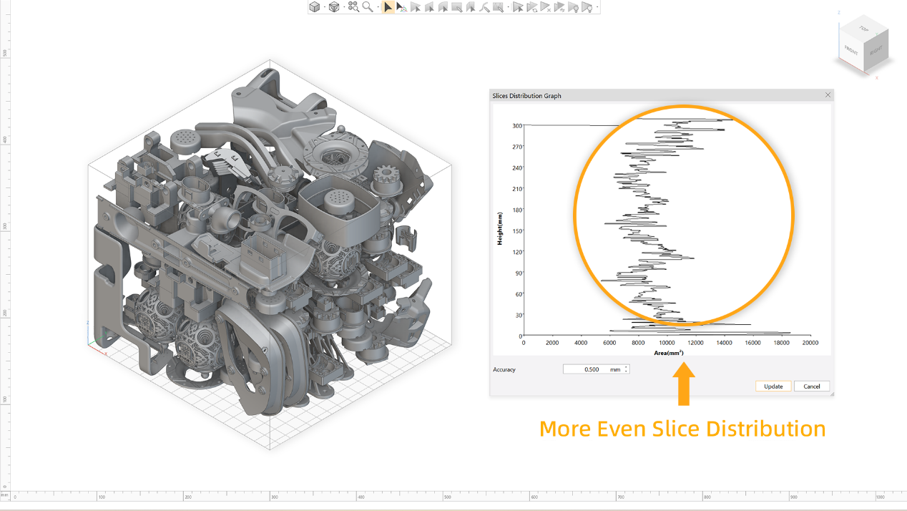
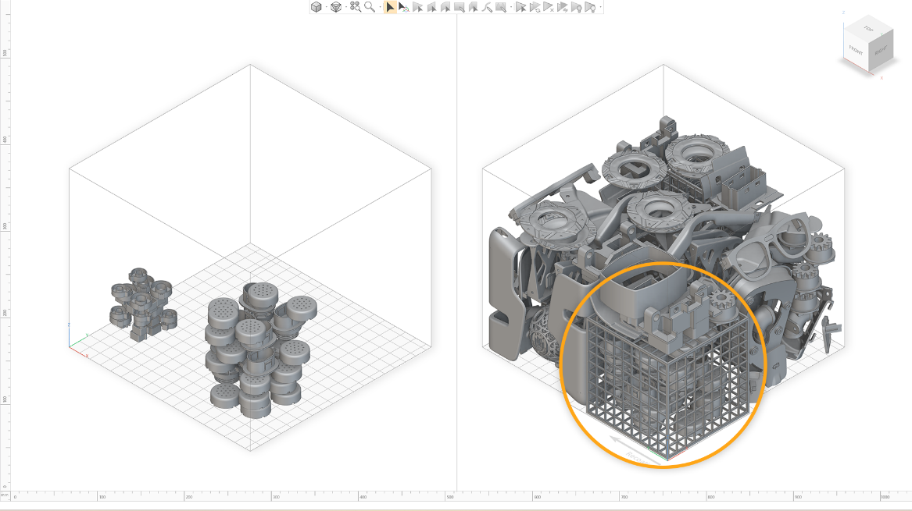

Nesting is a critical build-preparation step for Powder Bed Fusion technologies such as Selective Laser Sintering (SLS). A good nesting workflow increases throughput by placing many parts into a single build while reducing wasted volume, print time, and operational risk.

This project focuses on practical nesting methods for production environments where engineers handle large batches of parts every day. The workflow combines fast placement, controllable build objectives, and visual feedback for print-quality checks.

## Fast Nesting

For high-volume users, quick and repeatable results are essential. GPU acceleration helps generate accurate nesting results with a single click and can distribute parts across multiple platforms when the batch is too large for one build.

## Build-Height Reduction

Reducing the maximum build height can shorten SLS build time and lower production cost. The algorithm can prioritize a lower Z height while still preserving spacing and collision constraints.

## Slice-Area Balancing

Slice distribution is important for thermal stability in SLS printing. A more even layer-by-layer scan area helps reduce heat concentration and improves print reliability.

## Combined Optimization

In production, nesting quality is not just about packing density. The workflow can consider build height, slice distribution, part spacing, and printing risk together to produce more reliable layouts.

## Part Classification and Sinter Boxes

Sub-nesting and classification help prevent small parts from getting lost, protect fragile parts, and group parts by customer or order. After classification, engineers can create labeled sinter boxes to simplify post-processing and delivery.

The PDF version is available for download: [3d_nest.pdf](./3d_nest.pdf)

